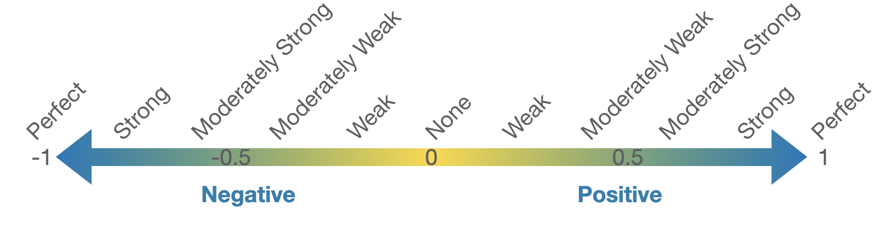
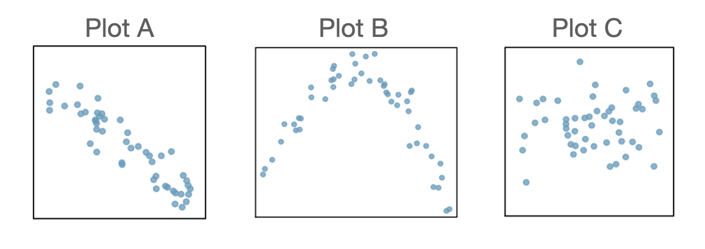
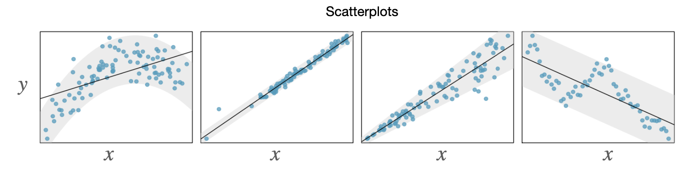
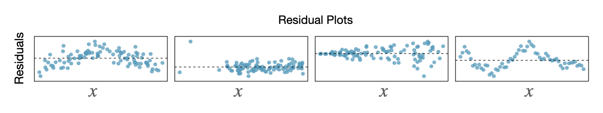

```{r}
library(tidyverse)
```

## Download or print notes to PDF {.smaller}

If you'd like to export this presentation to a PDF, do the following

::: nonincremental
1.  Toggle into Print View using the E key.
2.  Open the in-browser print dialog (CTRL/CMD+P)
3.  Change the **Destination** to **Save as PDF**.
4.  Change the **Layout** to **Landscape**.
5.  Change the **Margins** to **None**.
6.  Enable the **Background graphics** option.
7.  Click **Save**.
:::

This feature has been confirmed to work in Google Chrome and Firefox.

## Bivariate Relationships {.smaller}

```{r}
library(datasets)
 
state <- state.x77 |>
    as_tibble(rownames = "States")

set.seed(7493410)

keep <- sample(1:50, 30, replace = FALSE)

state_30 <- state[keep,]

```

::::::: columns
:::: column
::: fragment
```{r}
#| fig-height: 4
#| fig-width: 5


state_30 |>
  ggplot(aes(x = Illiteracy, y = `Life Exp`)) +
  geom_point(color = viridis::viridis(6)[1], size = 3) + 
  labs(y = "Life Expectancy (years)", 
       x = "Illiteracy Rate (% of population)", 
       title = "Illiteracy Rate vs. Life Expectancy",
       subtitle = "for 30 US States in 1970") + 
  theme(axis.title = element_text(size = 18)) + 
  theme_bw()


  #stat_smooth(method = "lm",
  #            formula = y ~ x, 
  #            geom = "smooth", 
  #            se = FALSE)

```
:::
::::

:::: column
::: fragment
```{r}
#| fig-width: 5
#| fig-height: 4
state_30 |>
  ggplot(aes(x = `HS Grad`, y = Income)) +
  geom_point(color = viridis::viridis(6)[5], size = 3) + 
  labs(y = "Per Capita Income", 
       x = "Percentage of Population with High School Diploma", 
       title = "High School Graduation Rates vs. Income ",
       subtitle = "for 30 US States in 1970") + 
  theme(axis.title = element_text(size = 18)) + 
  theme_bw()
```
:::
::::
:::::::

::::: columns
::: column
[✍️ Describe the relationship between illiteracy rate and life expectancy shown in the scatterplot above.]{.fragment}
:::

::: column
[🗣 Describe the relationship between high school graduation rate and income using the scatterplot above.]{.fragment}
:::
:::::

```{r}
library(countdown)

countdown(minutes = 0, seconds = 30)
```

## Explanatory and Response Variables {.smaller}

[When discussing bivariate relationships, it is common to treat one variable as the **explanatory** and one as the **response**.]{.fragment}

:::: incremental
::: fragment
+----------------------------------------------------------------------+-----------------------------------------------+
| Explanatory Variable                                                 | Response Variable                             |
+======================================================================+===============================================+
| -   May help to explain or predict changes in the response variable. | -   The variable to be estimated or predicted |
|                                                                      |                                               |
| -   Quantitative                                                     | -   Quantitative                              |
|                                                                      |                                               |
| -   Sometimes referred to as                                         | -   Sometimes referred to as                  |
|                                                                      |                                               |
|     -   $x$ variable                                                 |     -   $y$ variable                          |
|                                                                      |                                               |
|     -   independent variable                                         |     -   dependent variable                    |
|                                                                      |                                               |
|     -   predictor variable                                           |                                               |
+----------------------------------------------------------------------+-----------------------------------------------+
:::
::::

## Example 📖

[If we are interested in trying to model (e.g., explain) life expectancy using illiteracy rate in 1970, which variable should we treat as the explanatory? Which variable should we treat as the response?]{style="color:blue;"}

::::: columns
::: column
```{r}
#| fig-height: 4
#| fig-width: 5
#| fig-align: center
state_30 |>
  ggplot(aes(x = Illiteracy, y = `Life Exp`)) +
  geom_point(color = viridis::viridis(6)[1], size = 3) + 
  labs(y = "Life Expectancy (years)", 
       x = "Illiteracy Rate (% of population)", 
       title = "Illiteracy Rate vs. Life Expectancy",
       subtitle = "for 30 US States in 1970") + 
  theme(axis.title = element_text(size = 18)) + 
  theme_bw()
```
:::

::: column
Answer in Poll Everywhere

pollev.com/erinhowardstats

{fig-align="center"}
:::
:::::

## Measuring *Linear* Strength {.smaller}

:::: incremental
-   The correlation coefficient, $R$, measures the strength of a [linear]{.fragment .highlight-red} association between two quantitative variables.

-   The correlation between two quantitative variables will always be a value between -1 and 1.

::: fragment

:::

-   $R = \frac{1}{n-1}\sum \limits_{i=1}^n\bigg(\frac{x_i-\overline{x}}{s_x} \bigg)\bigg(\frac{y_i-\overline{y}}{s_y} \bigg)$
::::

## Example Scatterplots & Correlation

For each of the scatterplots below, estimate the correlation coefficient for the relationship between the explanatory and response variables.

{fig-alt="Three plots. Plot A: as x increases, y decreases in a linear fashion. Plot B: The scatterplot follows a paraboic shape. Plot C: As x increases, y seems to neither increase nor decrease."}

## Simple Linear Regression {.smaller}

::: incremental
-   Simple linear regression is the statistical method for fitting a line to describe the relationship between two quantitative variables.

-   We want to find a line of the form $\hat{y} = b_0 + b_1 x$
:::

:::::: columns
:::: column
::: fragment
```{r}
#| fig-height: 4
#| fig-width: 5


state_30 |>
  ggplot(aes(x = Illiteracy, y = `Life Exp`)) +
  geom_point(color = viridis::viridis(6)[1], size = 3) + 
  labs(y = "Life Expectancy (years)", 
       x = "Illiteracy Rate (% of population)", 
       title = "Illiteracy Rate vs. Life Expectancy",
       subtitle = "for 30 US States in 1970") + 
  theme(axis.title = element_text(size = 18)) + 
  theme_bw() + 
  stat_smooth(method = "lm",
              formula = y ~ x, 
              geom = "smooth", 
              se = FALSE, 
              color = viridis::viridis(6)[4])
```
:::
::::

::: column
 

[**What characteristics would the "line of best fit" have?**]{.fragment}
:::
::::::

## Simple Linear Regression {.smaller}

<iframe src="https://www.desmos.com/calculator/dygdzhgfpq" width="850" height="350">

</iframe>

::::: columns
::: {.column width="85%"}
Open the link: https://beav.es/cTp (also found in the Quick Links module on Canvas called "SLR Demo")

Try to find the line that best fits the data by adjusting the sliders below $b_0$ and $b_1$.

🗣 Compare your values of $b_0$ and $b_1$ to somewhere nearby. Discuss how you chose the values of $b_0$ and $b_1$.
:::

::: {.column width="15%"}
```{r}
library(countdown)
countdown(minutes = 2, seconds = 0)
```
:::
:::::

::: notes
slope = -1.14608 intercept = 72.1813
:::

## Residuals {.smaller}

::::::: incremental
:::::: columns
::: column
-   The residual of an observation is the difference in the observed response, $y_i$, and the predicted response based on the model fit, $\hat{y}_i$.

-   $e_i = y_i - \hat{y}_i$
:::

:::: column
::: fragment
```{r}
#| fig-height: 4
#| fig-width: 5


state_30 |>
  ggplot(aes(x = Illiteracy, y = `Life Exp`)) +
  geom_point(color = viridis::viridis(6)[1], size = 3) + 
  labs(y = "Life Expectancy (years)", 
       x = "Illiteracy Rate (% of population)", 
       title = "Illiteracy Rate vs. Life Expectancy",
       subtitle = "for 30 US States in 1970") + 
  theme(axis.title = element_text(size = 18)) + 
  theme_bw() + 
  stat_smooth(method = "lm",
              formula = y ~ x, 
              geom = "smooth", 
              se = FALSE, 
              color = viridis::viridis(6)[4])
```
:::
::::
::::::
:::::::

## Least Squares Regression Line {.smaller}

::: incremental
-   The least squares regression line (LSRL) is calculated by finding the line that minimizes the sum of the squared residuals.

-   When fitting the LSRL, we generally require:

    -   Linearity - the data should indicate a linear trend

    -   Nearly normal residuals - the residuals should be approximately normally distributed

    -   Constant variability - the variability of the points around the line should be roughly constant

    -   Independent observations

-   The above conditions are generally checked using a residual plot (coming up...)

-   If the above conditions are met, we can fit the LSRL using the following estimates $b_1 = \frac{s_y}{s_x}R$ and $b_0 = \overline{y} - b_1\overline{x}$

[*In practice, we compute these estimates using R*. *Coming up...*]{.fragment}
:::

## Interpreting the LSRL {.smaller}

$$ \hat{y} = b_0 + b_1 x$$

-   Interpreting the intercept estimate, $b_0$: [the expected value of the response variable when the explanatory variable is equal to 0.]{.fragment}

-   Interpreting the slope estimate, $b_1$: [For a one unit increase in the explanatory variable, we expect the response to change by $b_1$.]{.fragment}

::::::: columns
:::: column
::: fragment
```{r}
#| fig-height: 3.5
#| fig-width: 4.5


state_30 |>
  ggplot(aes(x = Illiteracy, y = `Life Exp`)) +
  geom_point(color = viridis::viridis(6)[1], size = 3) + 
  labs(y = "Life Expectancy (years)", 
       x = "Illiteracy Rate (% of population)", 
       title = "Illiteracy Rate vs. Life Expectancy",
       subtitle = "for 30 US States in 1970") + 
  theme(axis.title = element_text(size = 18)) + 
  theme_bw() + 
  stat_smooth(method = "lm",
              formula = y ~ x, 
              geom = "smooth", 
              se = FALSE, 
              color = viridis::viridis(6)[4])
```
:::
::::

:::: column
```{r}
state_30 <- state_30 |>
  rename("LifeExp"=`Life Exp`)
```

::: fragment
```{r}
#| echo: true
lm(LifeExp ~ Illiteracy, data = state_30)
```
:::

[$$\hat{y} = 72.181 - 1.146x$$ where $\hat{y}$ is the predicted average life expectancy and $x$ represents illiteracy rate.]{.fragment style="color:blue;"}
::::
:::::::

## Example 📖

[The LSRL that best fits the illiteracy rate vs. life expectancy data is]{style="color:blue;"}

[$$\hat{y} = 72.181 - 1.146x$$ where $\hat{y}$ is the predicted average life expectancy and $x$ represents illiteracy rate.]{style="color:blue;"}

::: {.fragment fragment-index="1"}
[**Interpret the slope estimate from this LSRL:**]{style="color:blue;"}
:::

[Answer in Poll Everywhere (pollev.com/erinhowardstats)]{.fragment .fade-in-then-out fragment-index="1"}

```{r}
countdown(minutes = 0, seconds = 45)
```

## Basic Predictions from the LSRL {.smaller}

-   The LSRL can be used to predict the outcome of the response variable for given values of the explanatory variable.

::: fragment
### Example 📖

[$$\hat{y} = 72.181 - 1.146x$$ where $\hat{y}$ is the predicted average life expectancy and $x$ represents illiteracy rate.]{style="color:blue;"}
:::

 

[**Predict the average life expectancy in 1970 for a state with an illiteracy rate of 1.4%.**]{.fragment style="color:blue;"}

 

[$$\hat{y} = 72.181 - 1.146(1.4) = 70.577$$]{.fragment style="color:blue;"}

## Residuals (again) {.smaller}

Recall that the residual is difference in the observed response variable and the predicted response based on the model fit: $$e_i = y_i - \hat{y}_i$$

::: {.fragment fragment-index="1"}
### Example 📖

[$$\hat{y} = 72.181 - 1.146x$$ where $\hat{y}$ is the predicted average life expectancy and $x$ represents illiteracy rate.]{style="color:blue;"}
:::

 

[**Compute the residual for a state that had an illiteracy rate of 1.4% and an average life expectancy of 70.55.**]{.fragment style="color:blue;" fragment-index="2"}

[Answer in Poll Everywhere (pollev.com/erinhowardstats)]{.fragment .fade-in-then-out fragment-index="2"}

[$$e = 70.55 - 70.577 = -0.027$$]{.fragment style="color:blue;" fragment-index="3"}

## Residual Plot {.smaller}

[Recall that to fit the LSRL, we need four conditions to hold (see *Least Squares Regression Line* slide).]{.fragment}

[**Some of these conditions can be easily checked using a residual plot.**]{.fragment}

::::::: columns
:::: column
::: fragment
```{r}
#| fig-height: 3.5
#| fig-width: 4.5
mod <- lm(LifeExp ~ Illiteracy, data = state_30)

ggplot(mod, aes(y = .resid)) + 
  geom_point(aes(x = state_30$Illiteracy),
             color = viridis::viridis(6)[2], size = 3) + 
  geom_hline(yintercept = 0) + 
  labs(y = "Residuals", 
       x = "Illiteracy Rate (% of population)") + 
  theme(axis.title = element_text(size = 18)) + 
  theme_bw()
```
:::
::::

:::: column
::: incremental
-   Ideally, when fitting the LSRL, we see no obvious patterns in the residual plot.

-   If a pattern is visible, it might be an indication that one or more of the LSRL conditions are violated.
:::
::::
:::::::

## Violations of LSRL Conditions {.smaller}



::: fragment

:::

:::::::: columns
::: {.column width="4%"}
:::

::: {.column width="24%"}
[Linearity violated]{.fragment}
:::

::: {.column width="24%"}
[Nearly normal residuals violated]{.fragment}
:::

::: {.column width="24%"}
[Constant variability violated]{.fragment}
:::

::: {.column width="24%"}
[Independence violated]{.fragment}
:::
::::::::

## Example 📖 {.smaller}

[$$\hat{y} = 72.181 - 1.146x$$ where $\hat{y}$ is the predicted average life expectancy and $x$ represents illiteracy rate.]{style="color:blue;"}

::::: columns
::: column
```{r}
#| fig-height: 3.5
#| fig-width: 4.5
mod <- lm(LifeExp ~ Illiteracy, data = state_30)

ggplot(mod, aes(y = .resid)) + 
  geom_point(aes(x = state_30$Illiteracy),
             color = viridis::viridis(6)[2], size = 3) + 
  geom_hline(yintercept = 0) + 
  labs(y = "Residuals", 
       x = "Illiteracy Rate (% of population)") + 
  theme(axis.title = element_text(size = 18)) + 
  theme_bw()
```
:::

::: column
 

 

[Are any of the LSRL conditions (linearity, normal residuals, constant variability, or independence) violated for the model that was fit for illiteracy vs. life expectancy?]{style="color:blue;"}
:::
:::::

## Prediction & Confidence Intervals {.smaller}

[The model predicted that for a state with an illiteracy rate $1.4\%$, the life expectancy was 70.577 years in 1970.]{style="color:blue;"}

[$$\hat{y} = 72.181 - 1.146(1.4) = 70.577$$]{style="color:blue;"}

::: fragment
#### Prediction Intervals for a Single Response Value

We know that this prediction in based on a sample and that a different sample of observations would have likely yielded a slightly different prediction.

[We can address the uncertainty in the prediction for this single response value using a **prediction interval**.]{.fragment}
:::

::: fragment
```{r}
#| echo: true
predict(mod, newdata = data.frame(Illiteracy = 1.4), interval = "prediction", level = 0.95)
```
:::

 

[For a single state with an illiteracy rate of 1.4% in 1970, we are 95% confident that the life expectancy was between 68.064 and 73.090 years, with a point estimate of 70.577 years.]{.fragment}

## Prediction & Confidence Intervals {.smaller}

The Central Limit Theorem tells us that mean values are more predictable than individual measurements.

::: fragment
Consider predicted the mean life expectancy for **all** states with an illiteracy rate of 1.4%.
:::

::: fragment
The estimate is the same as what we saw previously: [$\bar{y} = 72.181 - 1.146(1.4) = 70.577$]{style="color:blue;"}.
:::

:::: fragment
#### Confidence Intervals for a Mean Response Value

In addition to the point estimate for the mean life expectancy for **all** states with an illiteracy rate of 1.4%, we can provide a **confidence interval for the mean response value**.

::: fragment
```{r}
#| echo: true
predict(mod, newdata = data.frame(Illiteracy = 1.4), interval = "confidence", level = 0.95)
```

[We are 95% confident that mean life expectancy in 1970 for all states with an illiteracy rate of 1.4% was between 70.103 and 71.051 years, with a point estimate for the mean response of 70.577 years.]{.fragment}
:::
::::

## Prediction & Confidence Intervals {.smaller}

#### Prediction Interval for a Single Response Value

```{r}
#| echo: true
predict(mod, newdata = data.frame(Illiteracy = 1.4), interval = "prediction", level = 0.95)
```

#### Confidence Interval for a Mean Response Value

```{r}
#| echo: true
predict(mod, newdata = data.frame(Illiteracy = 1.4), interval = "confidence", level = 0.95)
```

[Compare the two intervals. Which one is wider and why do you think this?]{.fragment}

 

[_We won't cover anymore of the details of these intervals, but if you want to read more or explore the formulas used to calculate the interval bounds, check out [the textbook's supplemental material](https://www.openintro.org/go/?id=stat_extra_linear_regression_supp&referrer=os4_pdf)._]{.fragment}

```{r}
library(countdown)
countdown(minutes = 0, seconds = 45)
```

## R Code for This Week's Examples {.smaller}

```{r}
#| echo: true
#| eval: false

# Open the tidyverse library
library(tidyverse)

# Import the dataset, first need to download the data from Canvas
state_30 <- read_csv(file.choose())

# Create a scatterplot of the Illiteracy and LifeExp variables
ggplot(data = state_30, aes(x = Illiteracy, y = LifeExp)) + 
  geom_point(color = "purple", size = 3) + 
  labs(y = "Life Expectancy (years)", 
       x = "Illiteracy Rate (% of population)", 
       title = "Illiteracy Rate vs. Life Expectancy",
       subtitle = "for 30 US States in 1970") + 
  theme(axis.title = element_text(size = 18)) + 
  theme_bw() + 
  stat_smooth(method = "lm",
              formula = y ~ x, 
              geom = "smooth", 
              se = FALSE, 
              color = "darkgreen")

## Calculate the correlation between illiteracy rate and life exp
state_30 %>% summarise(cor = cor(Illiteracy, LifeExp))

# Estimate intercept and slope for LSRL
lm(LifeExp ~ Illiteracy, data = state_30)
```
